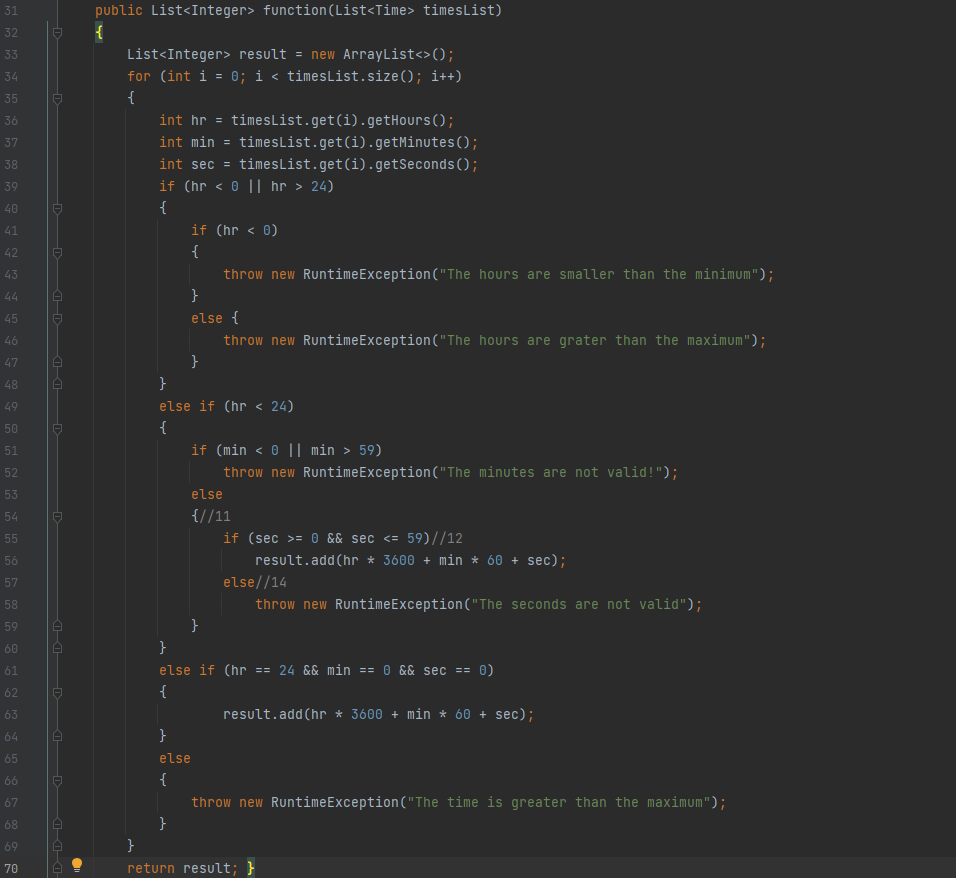
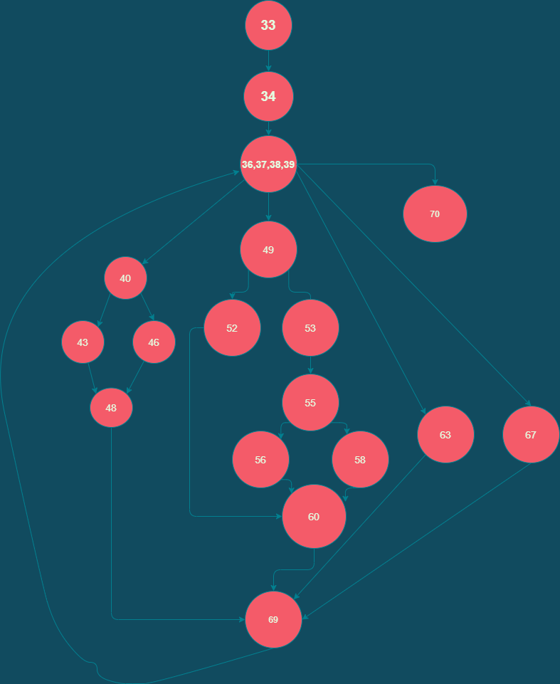

# Втора лабораториска вежба по Софтверско инженерство

## Андреј Мишевски, бр. на индекс 196100
### 1.Кодот врз кој го цртав CFG

### 2.Control Flow Graph

### 3.Цикломатската комплексност 

Цикломатската комплексност на дадениот код е 8.
Цикломатската комплексност на дадениот код ја пресметав користејќи ја формулата V(G) = E(G)-N(G)+2
Ребра - Јазли + 2.
Има 24 ребра и 18 Јазли
V(G) = 24 - 18 + 2
V(G) = 8
            
            
### 4.Multiple condition критериумот

#### Прв услов if (hr < 0 || hr > 24) 
1. T || x  Ако првото е точно не е битно дали вториот услове е точен или не
во било која ситуација ќе влезе во if(hr<0) вгнездениот услов

2. x || Т Ако второто е точно не е битно дали првиот услов е точен или не
ако второто е Т ќе влезе во else вгнезнениот услов

3. неТ || неТ Условот секогаш ќе паѓа
не влегува во вгнездените услови

#### Втор услов else if (hr < 24),
Ако е помало од 24 ќе влезе во условот во спротивно ќе продолжи со другите услови,
вгнезден подуслов на else if (hr < 24) е (min < 0 || min > 59)
1. T || x  Ако првото е точно не е битно дали вториот услове е точен или не

2. x || Т Ако второто е точно не е битно дали првиот услов е точен или не

3. неТ || неТ Условот секогаш ќе паѓа
ќе влезе во else вгнездениот подуслов

#### Трет услов else if (hr == 24 && min == 0 && sec == 0), 
Тука ќе влезе само доколку сите услови се исполнети инаку ќе продолжи понатаму

#### Четврт услов else ќе влезе доколку не е влезен во предходните други услови.

### 5.Every branch критериумот

